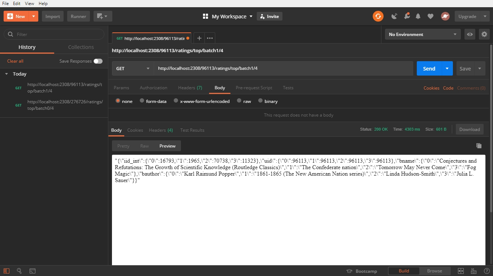
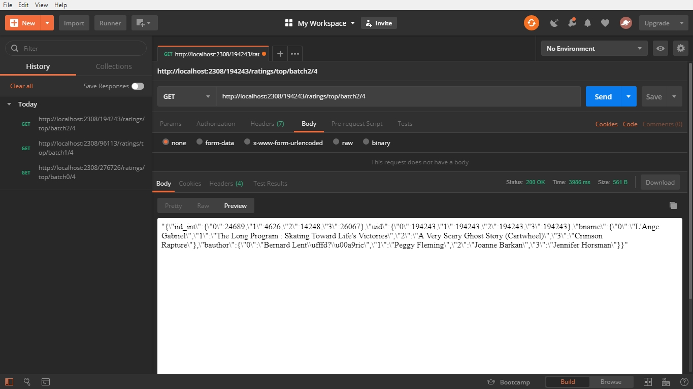
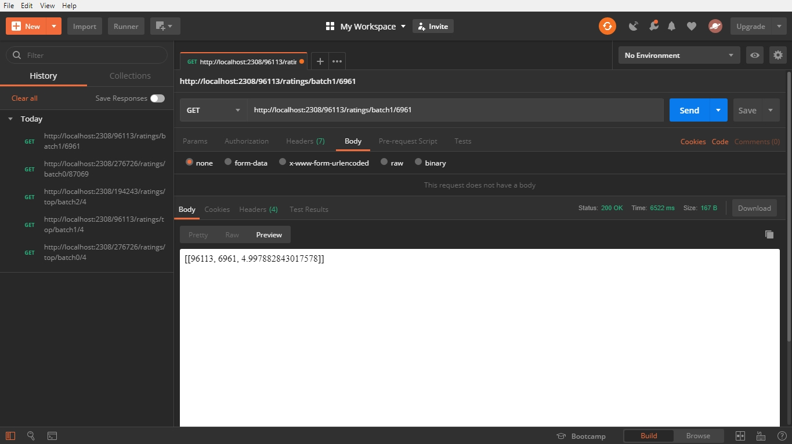
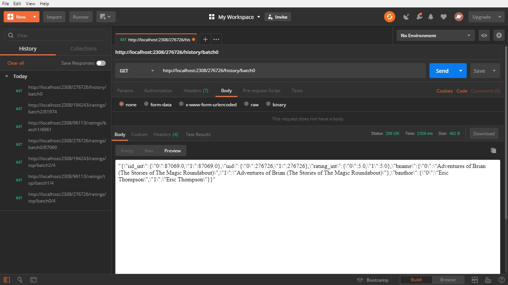
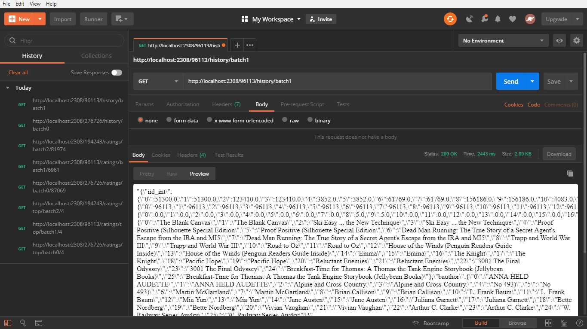
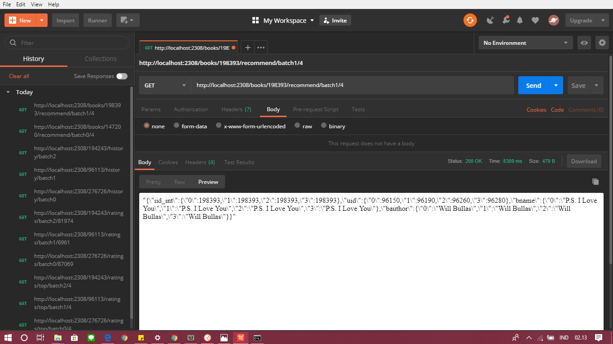
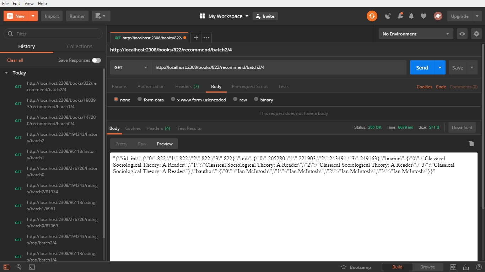

# Final Project Big Data
## Datastream and Recommendation System with Kafka and Flask REST-API

Oleh :
* Ivanda Zevi Amalia - 05111640000041

## Deskripsi
Membuat Recommendation Engine dengan menggunakan dataset **_Book-Crossing_** http://www2.informatik.uni-freiburg.de/~cziegler/BX/ <br><br>

### Struktur Sistem
* **_producer.py_** : berperan sebagai _producer_ pada Kafka, bertugas untuk mengirim pesan yang berisi dataset kepada _consumer.py_ dengan delay tertentu.
* **_consumer.py_** : berperan sebagai _consumer_ pada Kafka, bertugas menerima pesan yang berisi dataset dari _producer.py_ dan kemudian menyimpannya kedalam beberapa batch. 
* **_server.py_** : menginisialisasi server web CherryPy yang menjalankan Flask _app.py_ untuk membuat konteks _engine.py_ berbasis Spark. 
* **_engine.py_** : inti dari sistem dan menyimpan semua perhitungan yang ada. 
* **_app.py_** : penghubung _server.py_ dan _engine.py_, sebagai tempat routing.

### Model yang Digunakan
* Model 1 : 500.000 data pertama
* Model 2 : 500.000 data kedua
* Model 3 : 500.000 data ketiga 

### Batch pada Kafka
Batas pada setiap batch pada Kafka adalah sebanyak 500.000 data tiap file

## Cara Menggunakan
1. Jalankan Zookeeper
2. Jalankan Kafka Server
3. Buat topic pada Kafka
4. Jalankan _producer.py_
5. Jalankan _consumer.py_
6. Setelah pengiriman data selesai, jalankan _server.py_


## URL
**Top Ratings**
```sh
**GET** http://<ServerIP>:2308/<int:user_id>/ratings/top/batch0/<int:count> 
**GET** http://<ServerIP>:2308/<int:user_id>/ratings/top/batch1/<int:count>
**GET** http://<ServerIP>:2308/<int:user_id>/ratings/top/batch2/<int:count>
```

**Book Ratings**
```sh
**GET** http://<ServerIP>:2308/<int:user_id>/ratings/batch0/<int:book_id>
**GET** http://<ServerIP>:2308/<int:user_id>/ratings/batch1/<int:book_id>
**GET** http://<ServerIP>:2308/<int:user_id>/ratings/batch2/<int:book_id>
```

**Ratings History**
```sh
**GET** http://<ServerIP>:2308/<int:user_id>/history/batch0
**GET** http://<ServerIP>:2308/<int:user_id>/history/batch1
**GET** http://<ServerIP>:2308/<int:user_id>/history/batch2
```

**Book Recommend**
```sh
**GET** http://<ServerIP>:2308/books/<int:book_id>/recommend/batch0/<int:count>
**GET** http://<ServerIP>:2308/books/<int:book_id>/recommend/batch1/<int:count>
**GET** http://<ServerIP>:2308/books/<int:book_id>/recommend/batch2/<int:count>
```

## Image
### Top Ratings 



<br>
### Movie Ratings



<br>
### Ratings History



<br>
### Movie Recommend



