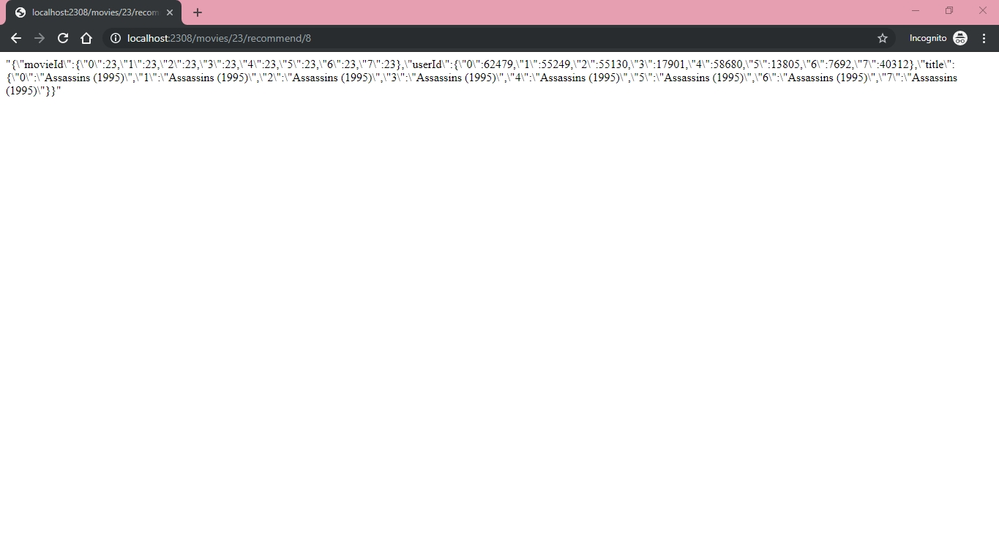

# Tugas Implementasi Recommendation Systems

**_server.py_** : menginisialisasi server web CherryPy yang menjalankan Flask _app.py_ untuk membuat konteks _engine.py_ berbasis Spark.  
**_engine.py_** : inti dari sistem dan menyimpan semua perhitungan yang ada.  
**_app.py_** : penghubung _server.py_ dan _engine.py_, sebagai tempat routing.

## REST API
> `Top Ratings` : **GET** /<int:user_id>/ratings/top/<int:count>  
> `Movie Ratings` : **GET** /<int:user_id>/ratings/<int:movie_id>  
> `Ratings History` : **GET** /<int:user_id>/history  
> `Movie Recommend` : **GET** /movies/<int:movie_id>/recommend/<int:count>  

### Top Ratings 

### Movie Ratings

### Ratings History

### Movie Recommend

